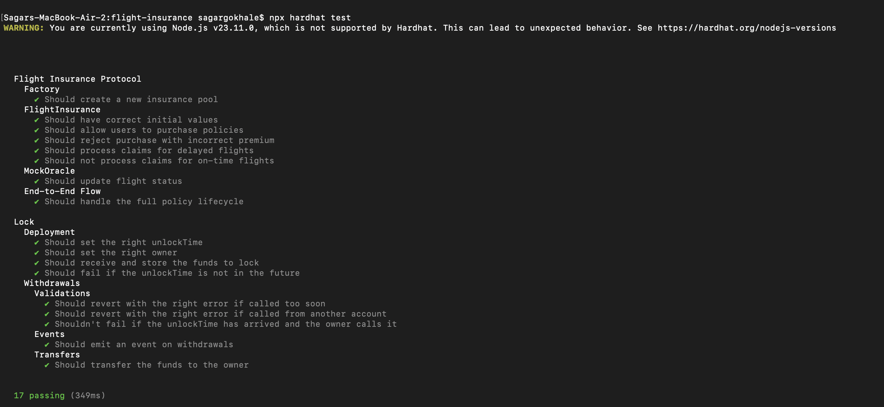
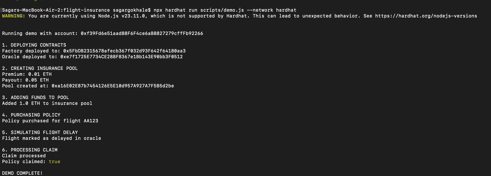

# Decentralized Flight Insurance Protocol

A blockchain-based parametric insurance solution that automates payouts for flight delays without requiring manual claims assessment.




## Project Overview

This project implements a decentralized parametric insurance protocol focused on flight delay insurance. Unlike traditional insurance that requires manual claims assessment, parametric insurance automatically processes claims based on predefined conditions verified by oracle data.

Key features:
- Automatic policy issuance
- Predefined payout conditions
- Oracle-based flight delay verification
- Automated claim processing

## Project Structure

```
flight-insurance/
├── contracts/                # Smart contract source files
│   ├── InsuranceFactory.sol  # Factory contract for creating insurance pools
│   ├── FlightInsurance.sol   # Core insurance contract for policies and claims
│   ├── MockOracle.sol        # Oracle simulation for flight delay data
│   └── Lock.sol              # Default Hardhat example contract
├── scripts/                  # Deployment and demo scripts
│   ├── deploy.js             # Contract deployment script
│   └── demo.js               # End-to-end demo script
├── test/                     # Test files
│   └── FlightInsurance.test.js  # Comprehensive test suite
├── hardhat.config.js         # Hardhat configuration
└── .env                      # Environment variables (not in repo)
```

## Smart Contracts

### InsuranceFactory.sol
- Creates and manages flight insurance pools
- Maintains a registry of all insurance pools
- Allows for easy discovery of available insurance products

### FlightInsurance.sol
- Manages individual policies for specific flights
- Handles premium collection and payout distribution
- Processes claims based on flight delay information
- Maintains policy status and metadata

### MockOracle.sol
- Simulates an external data source for flight information
- Provides flight delay status for testing purposes
- Can be replaced with a real oracle service in production

## Setup and Installation

1. Clone the repository:
```bash
git clone https://github.com/your-username/flight-insurance.git
cd flight-insurance
```

2. Install dependencies:
```bash
npm install
```

3. Compile the contracts:
```bash
npx hardhat compile
```

4. Run tests:
```bash
npx hardhat test
```

5. Run the demo:
```bash
npx hardhat run scripts/demo.js --network hardhat
```

## Testing

The project includes comprehensive tests covering:
- Insurance pool creation
- Policy purchase
- Premium validation
- Flight delay simulation
- Claim processing
- Payout verification

Run tests with:
```bash
npx hardhat test
```

## Demo

The demo script (`scripts/demo.js`) demonstrates the full insurance lifecycle:
1. Deploys all required contracts
2. Creates an insurance pool with specified premium and payout amounts
3. Adds funds to the insurance pool
4. Purchases a policy for a specific flight
5. Simulates a flight delay through the oracle
6. Processes the claim and verifies the payout

Run the demo with:
```bash
npx hardhat run scripts/demo.js --network hardhat
```

## Technology Stack

- Solidity: Smart contract development
- Hardhat: Development environment
- Ethers.js: Ethereum interaction library
- Chai: Testing framework
- OpenZeppelin: Security-audited contract implementations

## Future Enhancements

- Frontend interface for policy management
- Integration with real flight data through Chainlink oracles
- Support for additional risk categories beyond flight delays
- Dynamic premium calculation based on historical flight data
- Governance mechanisms for protocol upgrades

## Contributors

- Sagar Gokhale
- Pritam Chavan
